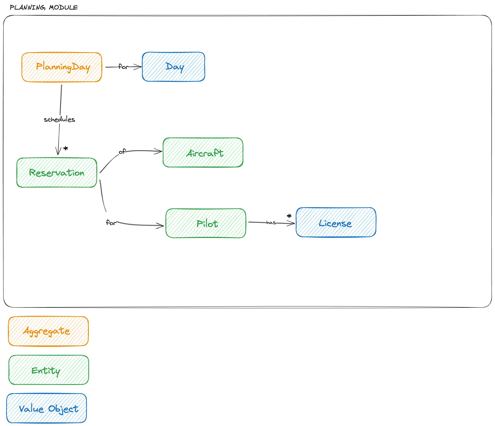

# 2024-01-05

This is first of hopefully many notes about the design decisions in the project. I will mostly focus on domain code
design and will try to explain some of the features implemented in the project.

# Domain knowledge

In aero club pilots would like to have simple reservation software so they can reserve aircraft for given day. Reservation
is just for a day (reserving an aircraft for more than one day is rare so I won't optimise for it).
There can be couple of rules who can reserve which aircraft, for example pilot needs to have sufficient license
to reserve an aircraft, they need to be possibly club members with active membership and the aircraft needs to be
ready to fly(has valid insurance, is in flying condition and needs to have valid technical review).

# Features

## Reserving an airplane by the pilot

There are couple of business rules(invariants) when an aircraft can be reserved:
1. pilot must have proper license ([SPL](https://en.wikipedia.org/wiki/Private_pilot_licence#Sailplanes)
   for gliders and [PPL](https://en.wikipedia.org/wiki/Private_pilot_licence) for airplanes)
2. pilot can reserve only one aircraft for given day
3. aircraft can't be reserved by more than one pilot

## Cancelling reservation

No extra rules here, just a way for canceling reservation.

## Listing all reservations

We need a way for listing all reservation.

# Design decisions

## Splitting into modules

The assumption of the project is to experiment with ways of organising code for non-trivial business software. Having this
in mind I decided to split domain into modules right from the start to spare some boring refactoring later on when 
introducing modules would happen.

## Choosing initial module and features

For first features I decided to implement simple aircraft reservation API. The features I'd like to implement are: 
reserving aircraft, cancelling reservation and listing reservation. As a name for the first module I choose Planning.

## First Aggregate Root

Having in mind the first features I'd like to design first Aggregate: reserving aircraft, cancelling reservation and 
listing reservation. The listing part is just read operation so it does not affect our Aggregate Root design. 
The important ones are reserving and cancelling reservations. First, lets look at some business rules we'd like out 
aggregate to guard. I choose three simple rules for reserving an aircraft:
1. pilot must have proper license ([SPL](https://en.wikipedia.org/wiki/Private_pilot_licence#Sailplanes)
   for gliders and [PPL](https://en.wikipedia.org/wiki/Private_pilot_licence) for airplanes)
2. pilot can reserve only one aircraft for given day
3. aircraft can't be reserved by more than one pilot for given day

The first decision to make is the boundaries of our aggregate. Candidates which came to mind are:
aircraft-scoped aggregate, pilot-scoped aggregate. However these two are not sufficient as aircraft-scoped could not
guard against 2. invariant and pilot-scoped could not guard against 3. It seems that we need to extend aggregate boundaries
to hold information about all aircraft reservations on given day. Sufficient design for Aggregate would be collection
of reservations (couple of aircraft and pilot entities) for given day. I named this aggregate PlanningDay and here it's
visualisation:

`PlanningDay` - aggregate root which represents given day and holds information about all reservations for given day

`Reservation` - Entity representing aircraft reservation of some pilot's, it can be cancelled

`Aircraft` - Entity representing aircraft in the aero club, I expect that there will be features that will change it's state
(for example changing state of insurance making aircraft not flying)

`Pilot` - Entity representing pilot, I expect that there will be some state changes (like revoked licenses or deactivated 
membership) so I modeled it as Entity right away

`License` - Value Object, as in the context of planning we just want to care about type of license (stateless object)

## Introducing Repository

Once I had some part of domain code (first Aggregate Root with some Entities and Value Object), I wanted to implement
persistence layer. I prepared simple Repository for `PlanningDay` Aggregate. I wanted to follow the rule of having direct
access only for Aggregate Roots(access to internal entities is only with traversal from the Aggregate Root), hence
just one Repository for `PlanningDay`. 

I added two implementations: `Database` for production and `InMemory` for tests.

### Nested structure

The one dilemma I had is whether to store `PlanningDay` Aggregate in DB as one flat row along with all nested entities or
to store each entity in separate table. I choose the latter mainly to see how it works and test out how it complicates
the write operation. The downside of this solution is that persistence is now more complicated: repository needs to
detect any changes in nested PlanningDay's entities (reservations, pilots and aircraft). The benefit is that it allows
more complicated search like search all reservations for given aircraft, pilot etc.

## Introducing Application Service

Once I had some of the domain code (`PlanningDay`) and persistence (`PlanningDayRepositories`) I needed a layer to 
glue these two so I have simple interface to use in my controllers. So first simple application service was created:
`ReservationService`, which takes `planning_day_repository` as dependency and can be used for making reservation.

Since I added in-memory repository implementation I used it in specs for ReservationService so we have fast application
layer specs.

## Omitting Repository in read endpoint

For listing all reservations I kind of omit domain code and use ActiveRecord directly. This is for convenience. I 
believe it's low risk design decision as it's just a read part and won't break any invariant, only thing to keep in mind
is to align persistence layer (how the reservation is stored) with API. Maybe in future I will introduce some other
translation layer.

# Next todos

1. Introducing new module (pilots profile is good candidate)
2. Managing transactions when doing write operations (for example when storing PlanningDay)